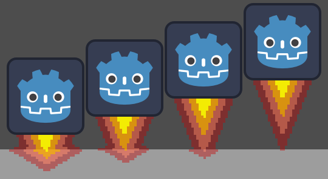

# Procedural Thruster Flamme Generator

<div align="center">

</div>

## 1. Description

This asset allow you to generate procedurally a pixel art flamme.

## 2. Parameters

| Parameter                     | Default Value     | Effects                                                               |
|-------------------------------|-------------------|-----------------------------------------------------------------------|
| sources                       | []                | FlammeSource array (see table below)                                  |
| force                         | 120               | Force of the flamme (common to all sources)                           |
| random_power_range            | (-10, 10)         | Random addition of force (common to all sources)                      |
| random_power_range_per_source | (-4, 4)           | Random addition of force (each source process his own random)         |
| cooling_flow                  | 10                | Cooling for each pixel parsed (lower = longer flamme)                 |
| cooling_flow_ground           | 15                | Same as ```cooling_flow``` but for the horizontal flow                |
| cooling_lateral               | 25                | Same as ```cooling_flow``` but for the laterals flows                 |
| manual_distance               | false             | If true, it allow you to set manually the bottom collision height     |
| manual_distance               | false             | If true, it allow you to set manually the bottom collision height     |
| distance                      | texture_size.y    | Flamme bottom collision Distance from top of the texture              |
| target_fps                    | 8                 | Number of frame per second (target)                                   |
| colors                        | []                | Colors to use. First color is the coolest and last one is the hottest |
| must_draw_debug               | false             | Draw debug texture                                                    |
| must_generate_laterals        | true              | Generate laterals                                                     |  


### 2.1 FlammeSource

| Parameter                     | Default Value     | Effects                                                                    |
|-------------------------------|-------------------|----------------------------------------------------------------------------|
| position                      | (0, 0)            | Position of flamme source on the 2D map (and so on the texture)            |
| markForLaterals               | true              | Must generate flamme laterals from this source (better performance if not) |  


## 3. Algorithm

### 3.1 main steps

- generate_flow
- generate_laterals
- generate_texture

---
### 3.2 - generate_flow

The generator start with an array of ```sources```.

Each source has a ```position``` corresponding to the position of an element on ```points``` 2D map.

From this ```position```, the algorithm go down to the bottom of the 2D map and when it hit the bottom, it split left and right.

Each source got the number of point you give in ```force``` + a random number in range you give in ```random_power_range``` (common for every source) + a random number in range you give in ```random_power_range_per_source```.

For each pixel parsed, the source lose ```cooling_flow``` points when the flow is between source and bottom of the texture.

For flow after the bottom split, ```cooling_flow_ground``` is used.

For each points parsed, his position is added to an internal array named ```initial_flow```.

---
### 3.3 - generate_laterals

```generate_laterals``` function is called for each element in ```initial_flow``` array.

This function works like ```generate_flows``` but in 4 directions using inital_flow element as a source.

It loose ```cooling_laterals``` points for each pixel parsed, and if the next pixel is "hotter" than (himself - ```cooling_laterals```), it return.

---
### 3.4 - generate_texture

Generate texture according to ```points``` 2D map and send it to material.

---